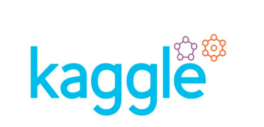
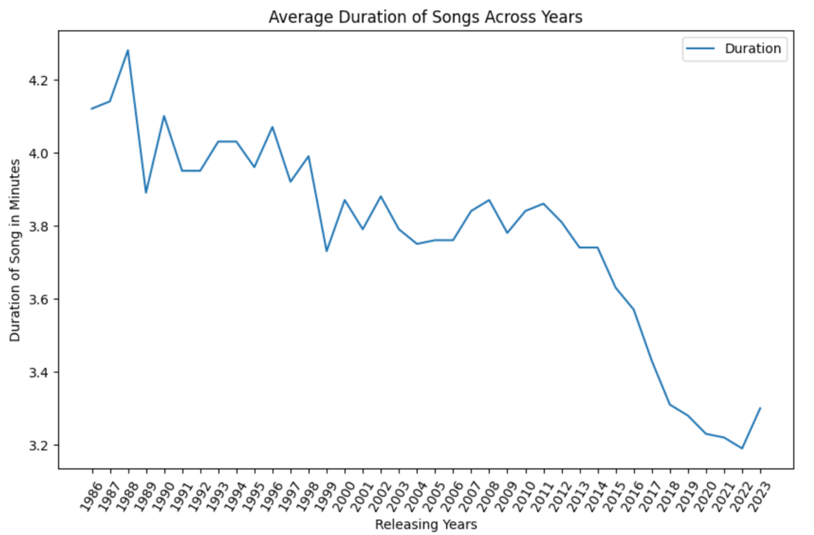
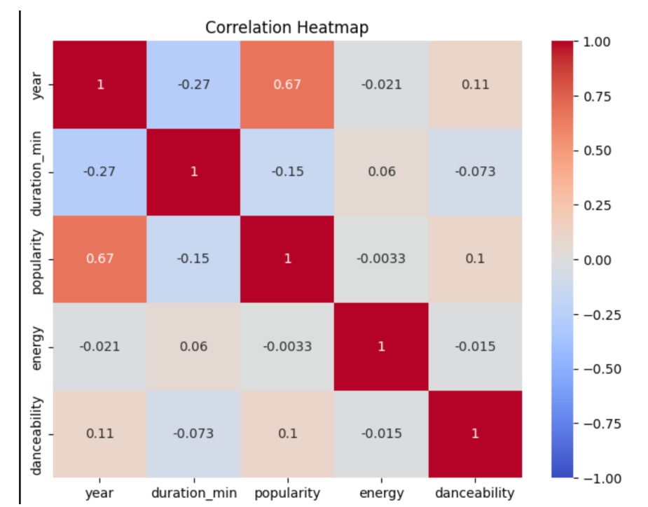
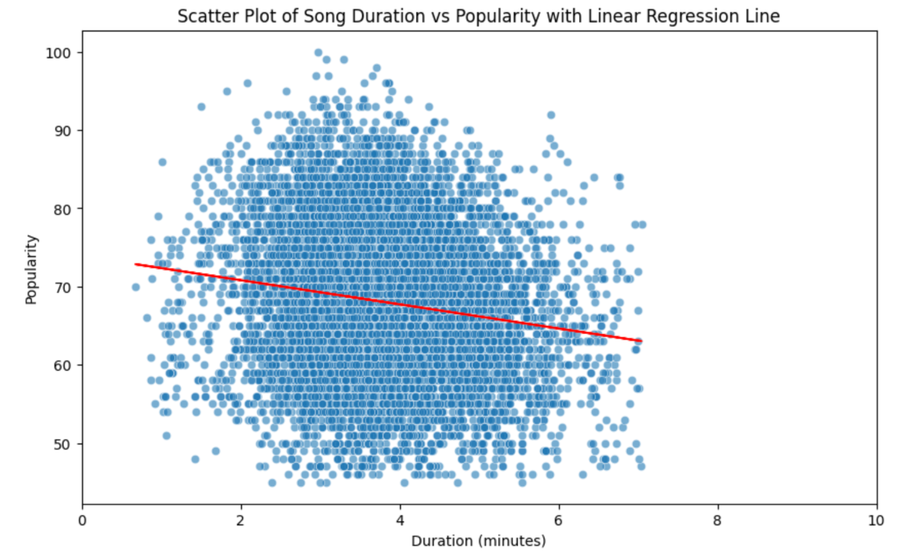
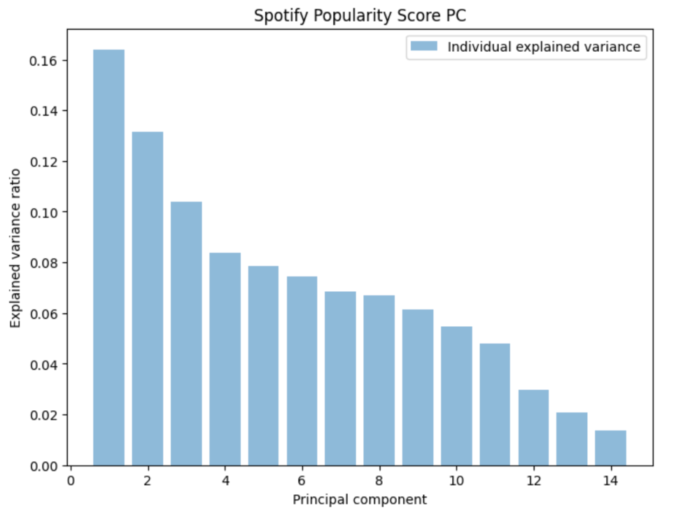
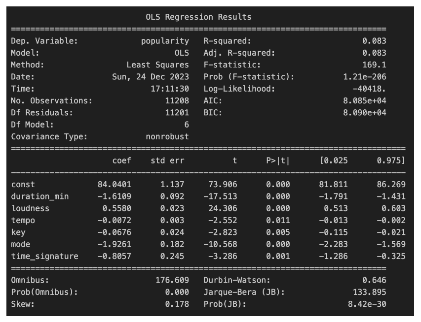
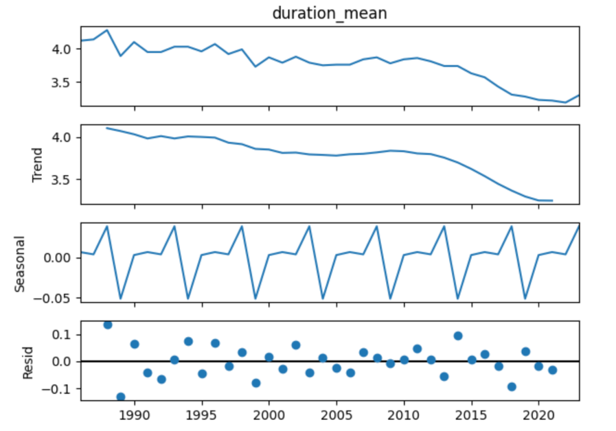

Spotify-song-duration-analysis

Research has shown that the average duration of mainstream songs has decreased over the years. In 2020, the average duration was 197 seconds or 3.2 minutes.

Why are mainstreams songs getting shorter? Is there possibly an economic incentive to create songs that are universally shorter in duration?

Online streaming platforms, like Spotify, generate their revenue from the amount of streams that a song accumulates indicating that there might be a positive relationship between duration and streams, and thus revenue.

Using a dataset acquired from Kaggle, this study aims to study that hypothesis.

Data Source: Kaggle

Dataset encompasses songs released between 1986 and 2023 that are accessible on Spotify.

Data collection involves utilizing a function to send requests to Spotify’s API, retrieving various attributes, and storing them in an Excel file.

The dataset comprises over 34 variables, which include 22 numerical variables related to characteristics and 12 categorical variables for artists, genre, and album type, among others. These variables fall into four types: float, integral, strings, and booleans.

 
 

Analysis

Average duration across the years (1986-2023) per the dataset

1. Correlation Analysis / Correlation Heatmap

2. Simple Regression

3. PCA Analysis

4. Multiple Regression

5. Time Series

Conclusion
This study's findings show that quantitative models may not capture a strong relationship between duration and amount of streams/popularity. This indicates that the descreasing trend in song duration might be influenced more by qualitative factors aside from streams alone.

Click on the jupyter notebook file (.ipynb) to learn further, including the code used to conduct this statistical study.

 

